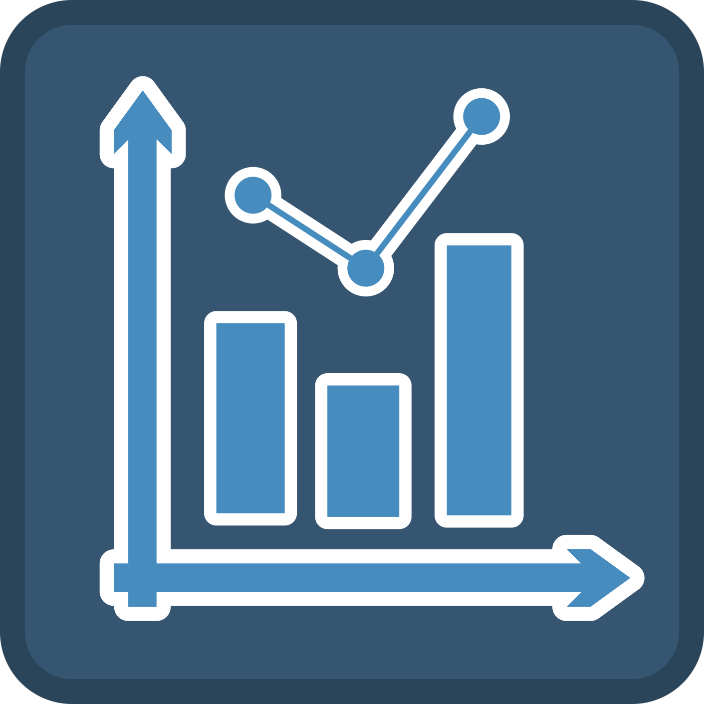
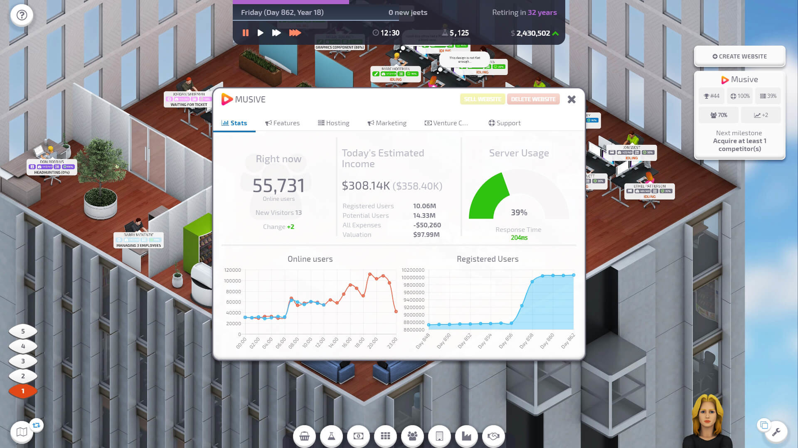
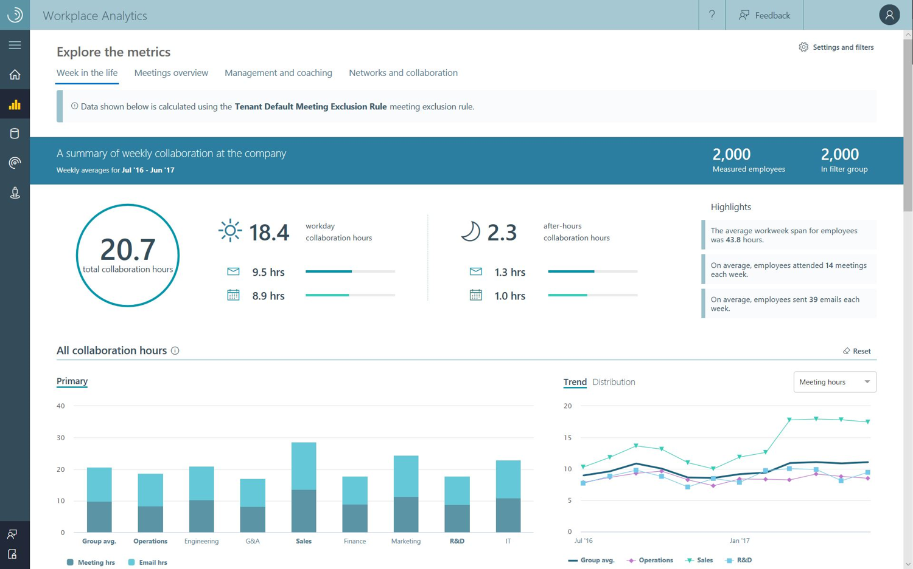
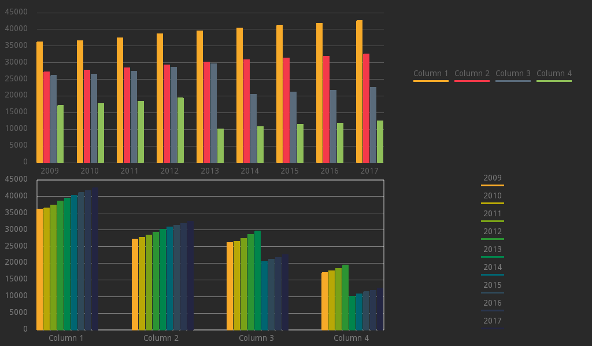

# Easy Charts
A library of Charts plotted in Control, 2D and 3D nodes to visualize general purpose datasets.  
Author: *"Nicolo (fenix) Santilio"*  
Version: *0.6.0*  
Wiki: *[wip](https://github.com/fenix-hub/godot-engine.easy-charts/wiki)*  
Godot Version: *3.2stable*   

## What is this?
*Easy Charts* is a collection of Control, 2D and 3D nodes to plot charts.   
This plugin was born from the personal necessity to plot some charts and tables for my university degree project.   
Here's an example:       
Charts are really useful when it comes to visually represent values in a powerful and more understandable way, mostly when these charts also have visually pleasing features.   
If you need to plot a chart with some values in it and just take a screenshot, or use it in your Godot Engine's game or project, you've come to the right place.   
   
[*Startup Company*](https://store.steampowered.com/app/606800/Startup_Company/)   
   
[*Microsoft Workplace Analytics*](https://www.microsoft.com/microsoft-365/partners/workplaceanalytics)  

## Collaborators
A huge thanks to
- [Marco](https://github.com/eddex)  
- [Jorge](https://github.com/JFerrerBeired)  
For contributing to this project.  
I cannot pay the free time they spent on this addon with their contribution, but thanks to them for adding new features and refactoring.

## How does it work?
There is a [WIKI](https://github.com/fenix-hub/godot-engine.easy-charts/wiki) with some tutorials, even if it is a work in progress.  
I'll make some videos as soon as possible.  

# Available Charts and when to use them    
This library offers a set of charts for each main Godot Node:   
- **Control Nodes:** "Control Charts" are fast Charts that can be plotted in a Control space, such as UIs or Control user interactable areas. They offer basic Control properties, such as Margins, size inheritance and control. No animations, no real time changes, just charts.   
- **2D Nodes:** "2D Charts" are a set of Charts which can be Used in 2D spaces. They offer additional tools, such as animations and real time changes in editor. They can be used to implement more aesthetic charts in 2D contexts.   
- **[wip] 3D Nodes:** "3D Charts" are a set of Charts which can be Used in both 2D and 3D spaces. They offer the possibility to plot 3D datasets, which are common in machine learning contexts or just data analysis. A Camera Control will also be available, which can be used to move around the chart.   

### Available Charts
- LineChart [Control, 2D, wip 3D]
- ColumnChart  [Control, 2D, wipr 3D]
- ScatterChart [wip Control, wip 2D, 3D]
- Piechart [Control]
- RadarChart [Control]  

### WIP Charts
- Area Chart
- Donut Chart
- Bubble Chart
- Parliament Chart  

### Some Examples    

  

##### Some references for charts and plots
[Flourish](https://app.flourish.studio/projects)   
[Chart.js](https://www.chartjs.org/samples/latest/)   
[Google Charts](https://developers.google.com/chart)   

# Disclaimer  
This addon was built for a **personal use** intention. It was released as an open source plugin in the hope that it could be useful to the Godot Engine Community.  
As a "work in progress" project, there is *no warranty* for any eventual issue and bug that may broke your project.  
I don't assume any responsibility for possible corruptions of your project. It is always advisable to keep a copy of your project and check any changes you make in your Github repository.  
-----------------
> This text file was created via [TextEditor Integration](https://github.com/fenix-hub/godot-engine.text-editor) inside Godot Engine's Editor.
> This text file was pushed  via [GitHub Integration](https://github.com/fenix-hub/godot-engine.github-integretion) inside Godot Engine's Editor.
