[](https://github.com/fenix-hub/godot-engine.easy-charts)
[](https://discord.gg/JNrcucg)
[](https://paypal.me/NSantilio?locale.x=it_IT)

Check my **[Discord](https://discord.gg/KnJGY9S)** to stay updated on this repository.  
*(Recommended since the AssetLibrary is not automatically updated)*  


# Easy Charts
A library of Charts plotted in Control, 2D and 3D nodes to visualize general purpose datasets.

Author: *"Nicolo (fenix) Santilio"*  
Version: *0.2.8*  
Wiki: *[wip]*  
Godot Version: *3.2stable*  

## What is this?
*Easy Charts* is a collection of Control, 2D and 3D nodes to plot charts.   
This plugin was born from the personal necessity to plot some charts and tables for my university degree project.   
Here's an example:       
Charts are really useful when it comes to visually represent values in a powerful and more understandable way, mostly when these charts also have visually pleasing features.   
If you need to plot a chart with some values in it and just take a screenshot, or use it in your Godot Engine's game or project, you've come to the right place.   
   
[*Startup Company*](https://store.steampowered.com/app/606800/Startup_Company/)   

   
[*Microsoft Workplace Analytics*](https://www.microsoft.com/microsoft-365/partners/workplaceanalytics)   


## How does it work?
*Easy Charts* contains a collection of nodes for each main node in Godot: Control Nodes, 2D Nodes and 3D Spatials.
To plot a chart you only need to:   
1. Save in your project a .CSV file containing the table of values you want to represent, just like the following one:   
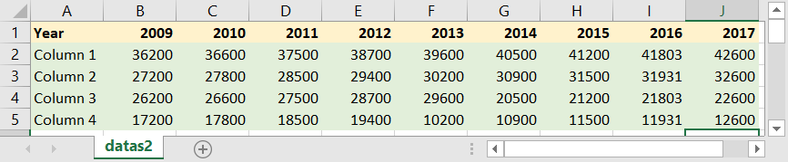
or, of course, the inverted one:   
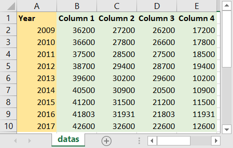   

2. In Godot, choose a Chart you'd like to plot. For istance, let's take a BarChart2D, specifically used to plot chart in a Node2D. You can instance it as a Child Scene or drag it from the Explorer:   
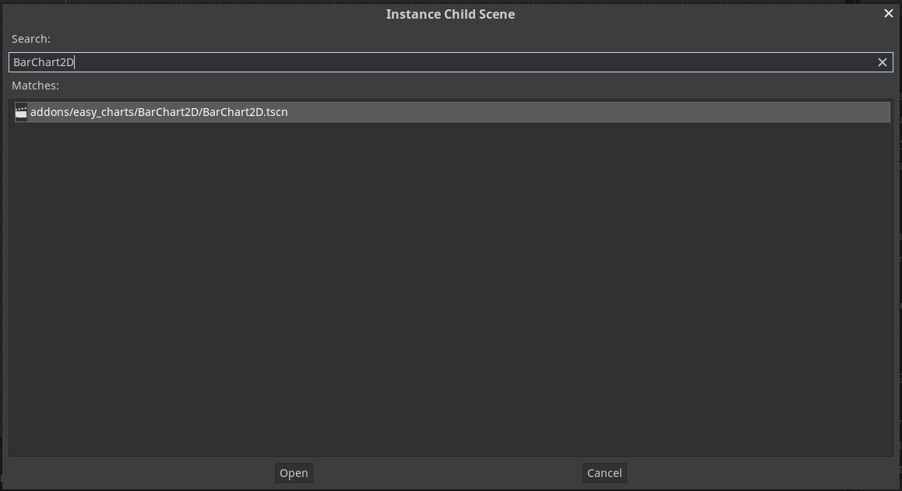   
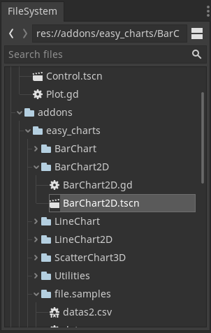   

3. Once in the tree, move it around as a normal Node, and set it's values directly in editor, like so:   
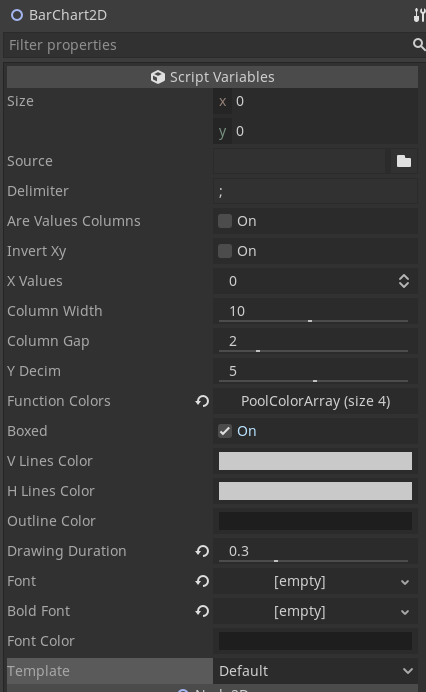   
You can directly select the file you want to plot from the editor, and change its values as you prefer. Most of the features will be displayed in real time in Editor while you are editing them.    

4. With just one line of code, you will be able to plot the chart. Use the line of code `$BarChart2D.plot()` to plot the chart with the properties edited in the editor.    
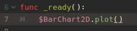   
Running the project like this, will produce this chart:   
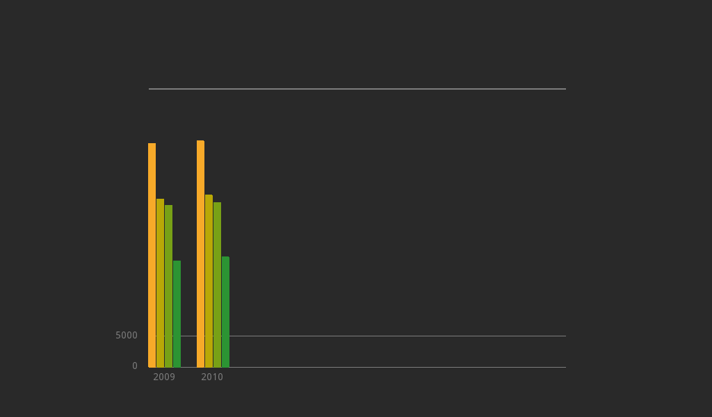

5. Moving the cursor around you will be able to see a floating box with the values contained in the chart:  
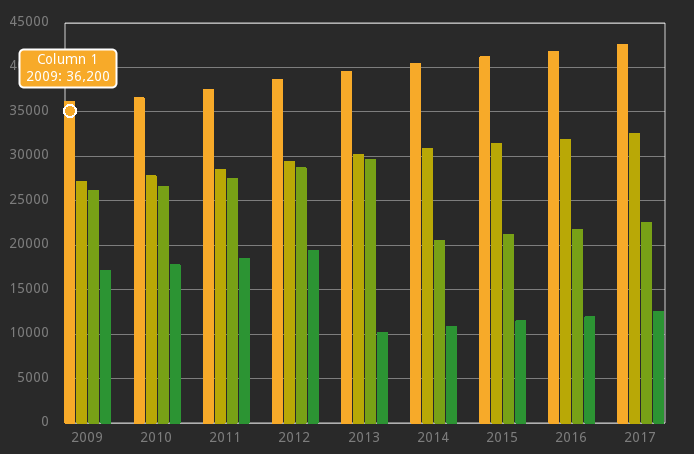

## Chart Tools   
Chart Tools are a set of utilities parallel to the plot itself.   
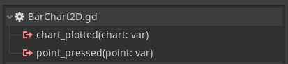    
Available Chart Tools are:  
- *Legend Output*: once a chart is plotted, you can get an output legend connecting the right signal, or just using custom functions. A legend is a simple `Array` of custom Control nodes, which contains informations about the chart for each function plotted.    
Once plotted, the chart will emit a custom `chart_plotted( chart )` signal. To get the legend, you just can connect this signal, or use the `get_legend` functions afterwards. A `legend` variable can then be used to print out or represent in a full customizable way the legend of functions. For example, these lines of codes:   
   
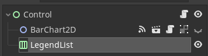    
You can get this result:   
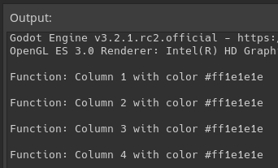
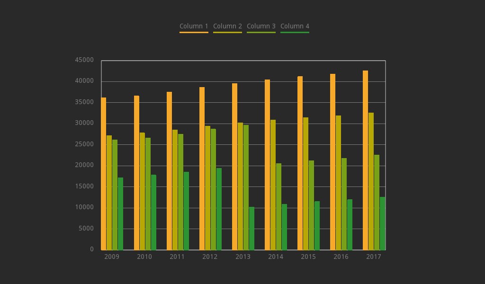

- *Point Value*: as you can see, each chart is pretty much interactable, giving you the opportunity to visualize the point represented with hovering it with your mouse. But what if you want to use its values for your own purposes? No problem, with the use of the signal `point_pressed ( point : Point )` you will be able to get all the informations about a point you clicked on in the chart.   
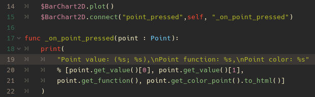   
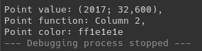    

### Table of features    

**Chart**    
| Function | Description |
| ------------- | ------------- |
|`plot()`|Plot the selected chart with in editor properties|
|`_plot(source : String, delimiter : String, are_values_columns : bool, x_values : int, invert_xy : bool = false)`|Plot the selected chart with hard coded properties|
|`get_legend()`|Get the legend of the current chart. Returns an **Array** containing control nodes, which can be added as children |

| Signals | Description |
| ------------- | ------------- |
|`chart_plotted(chart : Node)`|Returns the plotted Chart, which is a Node (Control, 2D Node, 3D Node)|
|`point_pressed(point : Point)`|Returns the point pressed with Left Click, which is a custom class *Point*|   


**Legend**   
| Function | Description |
| ------------- | ------------- |
|`get_function() -> Array`|Get the function's name, also visible in legend|
|`get_function_color() -> Color`|Get the function's color, also visible in legend|   


**Point**   
| Function | Description |
| ------------- | ------------- |
|`get_value() -> Array`|Get the point values, which are mapped coordinates in the plot. Returns a 2D array, with [0] and [1] as x and y values|
|`get_function() -> String`|Get the point's function name, also visible in legend and chart|
|`get_color_point() -> Color`|Get the point Color, also visible in legend and chart|   


**About templates**  
Templates are defined in a .json file, and the format is pretty straight forward.   
However, adding custom templates is not yet recommended, since it would require to edit the Charts scripts. Templates are anyway accessible and customizable.   
```
/addons/easy_charts/templates.json

"default":
{
"function_colors" : ["#1e1e1e","#1e1e1e","#1e1e1e","#1e1e1e"],
"v_lines_color" : "#cacaca",
"h_lines_color" : "#cacaca",
"outline_color" : "#1e1e1e",
"font_color" : "#1e1e1e"
},
```

# Available Charts and when to use them    
This library offers a set of charts for each main Godot Node:   
- **Control Nodes:** "Control Charts" are fast Charts that can be plotted in a Control space, such as UIs or Control user interactable areas. They offer basic Control properties, such as Margins, size inheritance and control. No animations, no real time changes, just charts.   
- **2D Nodes:** "2D Charts" are a set of Charts which can be Used in 2D spaces. They offer additional tools, such as animations and real time changes in editor. They can be used to implement more aesthetic charts in 2D contexts.   
- **[wip] 3D Nodes:** "3D Charts" are a set of Charts which can be Used in both 2D and 3D spaces. They offer the possibility to plot 3D datasets, which are common in machine learning contexts or just data analysis. A Camera Control will also be available, which can be used to move around the chart.

*Available Charts*:  
- LineChart [Control, 2D, wip 3D]
- BarChart  [Control, 2D, wipr 3D]
- ScatterChart [wip Control, wip 2D, 3D]
- RadarChart [Control]

*Work in progress*:
- Area Chart
- Pie Chart
- Donut Chart
- Radar Chart
- Bubble Chart
- Parliament Chart

### Some Examples    


##### Some references for charts and plots
[Flourish](https://app.flourish.studio/projects)   
[Chart.js](https://www.chartjs.org/samples/latest/)   
[Google Charts](https://developers.google.com/chart)   


# Disclaimer  
This addon was built for a **personal use** intention. It was released as an open source plugin in the hope that it could be useful to the Godot Engine Community.  
As a "work in progress" project, there is *no warranty* for any eventual issue and bug that may broke your project.  
I don't assume any responsibility for possible corruptions of your project. It is always advisable to keep a copy of your project and check any changes you make in your Github repository.  

-----------------
> This text file was created via [TextEditor Integration](https://github.com/fenix-hub/godot-engine.text-editor) inside Godot Engine's Editor.
> This text file was pushed  via [GitHub Integration](https://github.com/fenix-hub/godot-engine.github-integretion) inside Godot Engine's Editor.
