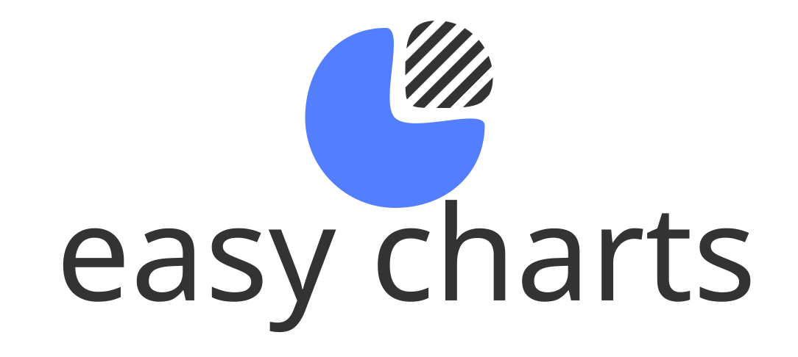
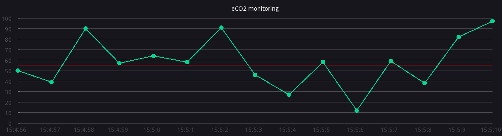
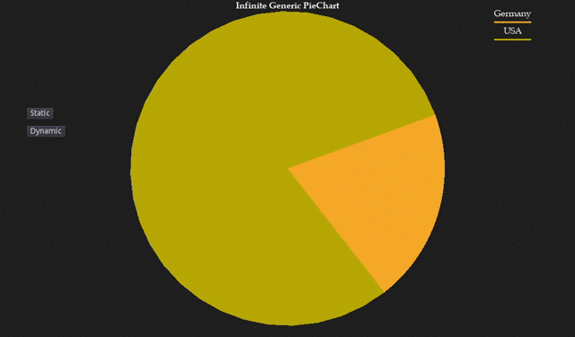
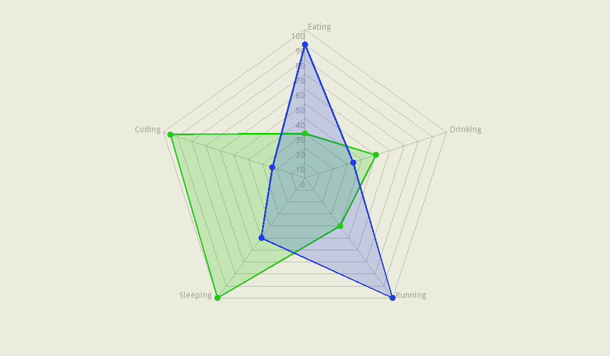
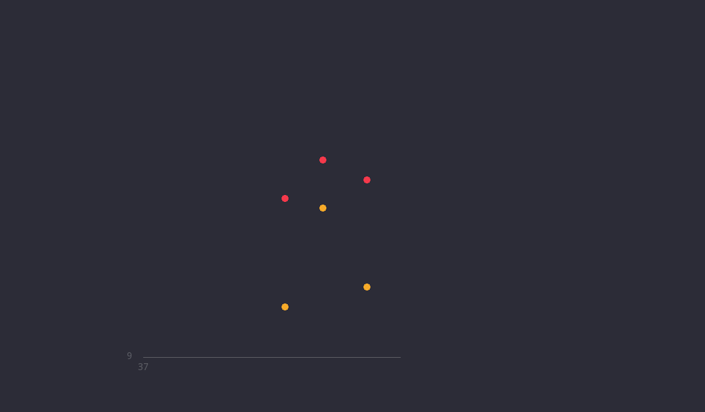
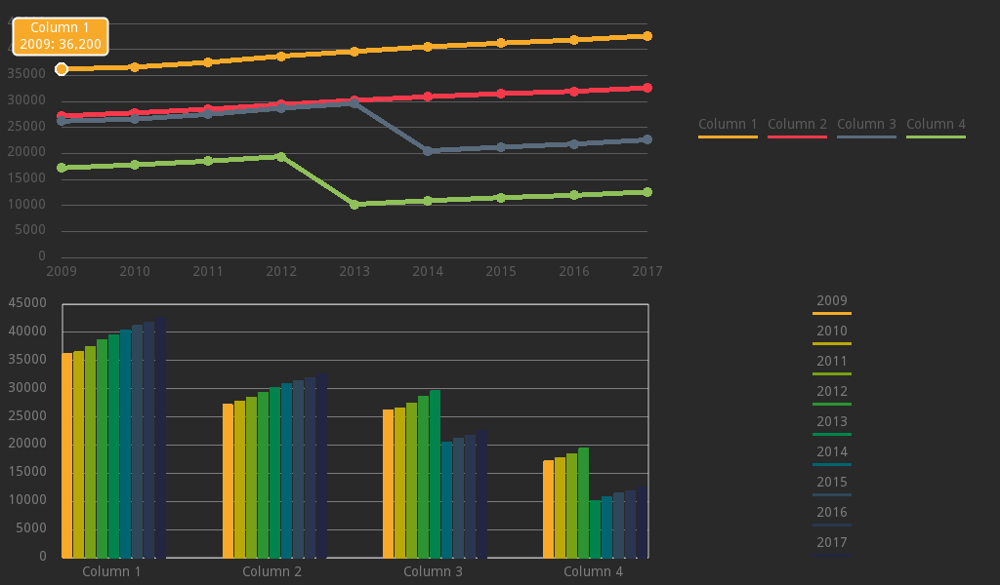
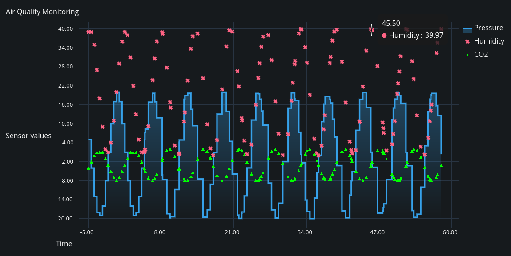

<p align="center">
  
</p>

<p align="center">
  <strong>Easy Charts</strong> is an open-source charting addon for Godot focused on fast, UI-friendly <code>Control</code>-based charts.
</p>

> Looking for the Godot 3.x version? See the [`godot-3` branch](https://github.com/fenix-hub/godot-engine.easy-charts/tree/godot-3).

## Project status

Easy Charts currently supports **Control charts only**.

- ✅ Implemented: Control chart plotters
- 🚧 Not available yet: dedicated 2D and 3D chart systems

## Available control chart plotters

The following plotters are available in `addons/easy_charts/control_charts/plotters/`:

| Plotter | Status |
|---|---|
| `AreaPlotter` | ✅ |
| `BarPlotter` | ✅ |
| `LinePlotter` | ✅ |
| `PiePlotter` | ✅ |
| `RadarPlotter` | ✅ |
| `ScatterPlotter` | ✅ |

> `FunctionPlotter` is the shared base plotter used internally by multiple chart types.

## Examples

You can find practical examples in `addons/easy_charts/examples/`.

<details>
  <summary>Realtime Line Chart</summary>

  
</details>

<details>
  <summary>Realtime Pie Chart</summary>

  
</details>

<details>
  <summary>Radar Chart</summary>

  
</details>

<details>
  <summary>Scatter Chart</summary>

  
</details>

<details>
  <summary>Composite Chart</summary>

  
</details>

<details>
  <summary>Multiplot</summary>

  
</details>

## Documentation

Read the full docs at: https://fenix-hub.github.io/godot-engine.easy-charts/

Local docs are in `./docs` and use MkDocs.

```bash
mise install            # optional: installs tooling from mise.toml
pip install -r requirements.txt
mkdocs serve
```

## Development

To work on the plugin, clone this repository and open it directly as a Godot project.

## Disclaimer

This addon is open source and still evolving. Use it with normal project safety practices (version control and backups), especially before integrating major updates.
