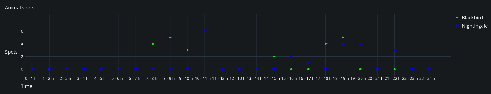

# Advanced Topics

This page contains some more detailed and advanced topics.

## Discrete axis for strings or integers

If the x or y values of your function are integers or floats, the chart will default to continuous axes which means, it will support interpolation of ticks and dynamically adjust the axes ranges.

If you have specific string values for one domain, you can simply use them as x-values when creating the `Function`:

```gdscript
var f := Function.new(
		['A', 'B', 'C'],
		[10, 20, 15],
		'Function Name',
		{ color = Color.GREEN, marker = Function.Marker.CIRCLE, type = Function.Type.SCATTER }
	)
```

In case you have a y-axis domain of integers and want to make it discrite (i.e. avoid any interpolation), you have to override the default behavior by defining your own `ChartAxisDomain` and y-label printing function _before_ plotting:

```gdscript
var y_max_value = ... # Compute the maximum of your y values
chart.set_y_domain(0, y_max_value) # Overwrite the default y-domain
chart.y_labels_function = func(value: float): return str(int(value)) # Define a custom y-label printing function

chart.plot(f)
```

A working example can be found in the `ScatterChartDiscrete` example in `addons/easy_charts/examples/scatter_chart_discrete/`. The following screenshot is from this example and illustrates a string-based x-domain (time as "hours of day") and integer-based y-domain ("count of spotted animals").




## Dynamic data

In some use-cases, a static chart is not enough. You might monitor some in-game process or recieve life-data from an API. You can update the values of your function by using the `Function.add_point(x_value, y_value)` method. When you are done adding your new data, call `Chart.queue_redraw()` to enforce a redraw of the chart.

```gdscript
f1.add_point(200, cos(200) * 20)
chart.queue_redraw()
```

> Note
>
> Adding new points is only supported for a float-based x-axis domain at the moment.

To limit the amount of data points drawn on the chart, you can use the `ChartProperties.max_samples` setting. It limits the number of drawn points by the provided amount. The data will still reside in your `Function` but will be skipped when drawing.

You can have a look at the examples provided - most of them have a button to enable live data.