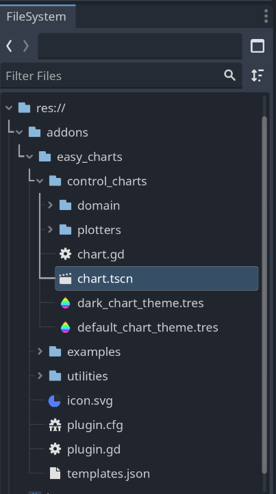
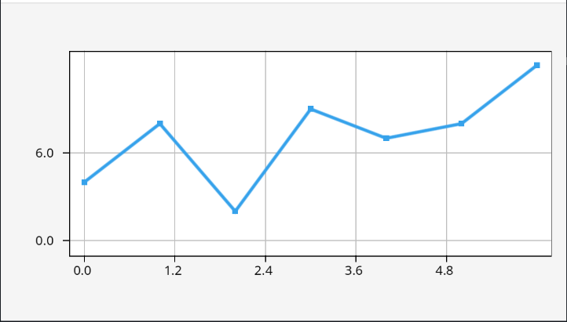
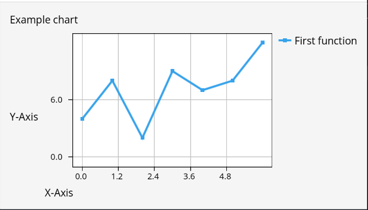

# Getting started

After you [installed](Installation) easy-charts, it is time to create your first chart.

## Basic scene setup

Since charts are control-node based, create a new `Control` node scene. To keep this example simple, we will create the `Chart` as a direct child of our scene root. For real use-cases, you can create charts in any deeply nested `Control` or ` Container` structure. The `Chart` will adjust and draw properly.


## Create a chart control

To create the chart, you have to instantiate the scene located at `addons/easy_charts/control_charts/chart.tscn`.



You can either do this via drag & drop into the scene tree or by instantiating the scene via script:

```gdscript
extends Control

func _ready() -> void:
	var chart_scene: PackedScene = load("res://addons/easy_charts/control_charts/chart.tscn")
	var chart: Chart = chart_scene.instantiate()
	add_child(chart)
```

When running this, you will see an empty chart with placeholders for axis and title labels. On the output, you will see two errors indicating that an empty chart cannot be drawn. We will fix this in the next step!


## Defining functions

To fill your chart with plots, you have to define `Function` objects and pass them to the `Chart.plot(...)` function. `Function`s have to be defined in code. Add the following code at the bottom of the `_ready()` function defined in the previous section:

```gdscript
	var function := Function.new(
		[0, 1, 2, 3, 4, 5, 6],  # The function's X-values
		[4, 8, 2, 9, 7, 8, 12], # The function's Y-values
		"First function",       # The function's name
		{
			type = Function.Type.LINE,       # The function's type
			marker = Function.Marker.SQUARE, # Some function types have additional configuraiton
			color = Color("#36a2eb"),        # The color of the drawn function
		}
	)

	chart.plot([function])
```

The first two parameters of the constructor define the x- and y-values used for drawing. The next parameter defines the name of the function which is used in legend and tooltips. The last parameter is a `Dictionary` defining the type of the plot (a line chart in this example) and additional optional parameters (e.g. marker types and colors).

Running the scene should give you a view similar to this:



To add multiple plots to the same chart, create multiple `Function` objects and pass them as part of the array.


## Additional configuration with `ChartProperties`

The `Chart.plot()` funciton takes a second parameter of type `ChartProperties`. This can be used to further customize the chart. For example, you can define axis labels and enable the legend by adding the following properties and passing them to the plot function:

```gdscript
	var chart_properties := ChartProperties.new()
	chart_properties.x_label = "X-Axis"
	chart_properties.y_label = "Y-Axis"
	chart_properties.title = "Example chart"
	chart_properties.show_legend = true

	chart.plot([function], chart_properties)
```

The result should look as follows:



> A note about theming
>
> The `ChartProperties` also contains settings to control drawing of the chart, like background colors, grids and ticks. However, these are deprecated in favor of using a `Theme`. See [Theming](Theming) for details.


## Putting it all together

The full script of this introduction looks like this:

```gdscript
extends Control

func _ready() -> void:
	var chart_scene: PackedScene = load("res://addons/easy_charts/control_charts/chart.tscn")
	var chart: Chart = chart_scene.instantiate()
	add_child(chart)

	var function := Function.new(
		[0, 1, 2, 3, 4, 5, 6],  # The function's X-values
		[4, 8, 2, 9, 7, 8, 12], # The function's Y-values
		"First function",       # The function's name
		{
			type = Function.Type.LINE,       # The function's type
			marker = Function.Marker.SQUARE, # Some function types have additional configuraiton
			color = Color("#36a2eb"),        # The color of the drawn function
		}
	)

	var chart_properties := ChartProperties.new()
	chart_properties.x_label = "X-Axis"
	chart_properties.y_label = "Y-Axis"
	chart_properties.title = "Example chart"
	chart_properties.show_legend = true

	chart.plot([function], chart_properties)
```