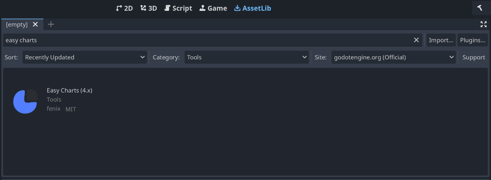
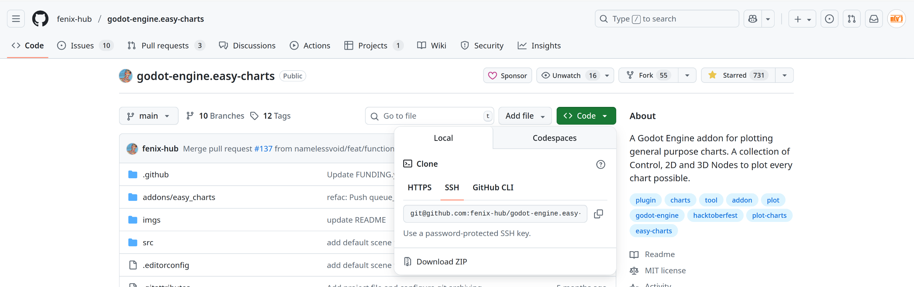

# Installation

You can either download easy charts from the Godot Asset Library or from Github.

## Godot Asset Library

Open the AssetLib in the godot editor and search for "easy charts". Then click the addon and select "Download" in the dialog that pops up. If you do not want to include the examples, you can de-select them inside the install popup.

## Github

To get a different or the latest version of the addon, you can download it from github. To get the latest version, simply click on "Code" and choose the "Download ZIP" option. Older versions can be fetched from the [Releases Page](https://github.com/fenix-hub/godot-engine.easy-charts/releases). Just unzip the file into your projects main directory (the ZIP-file contains the `/addons/easy-charts` subdirectories).

