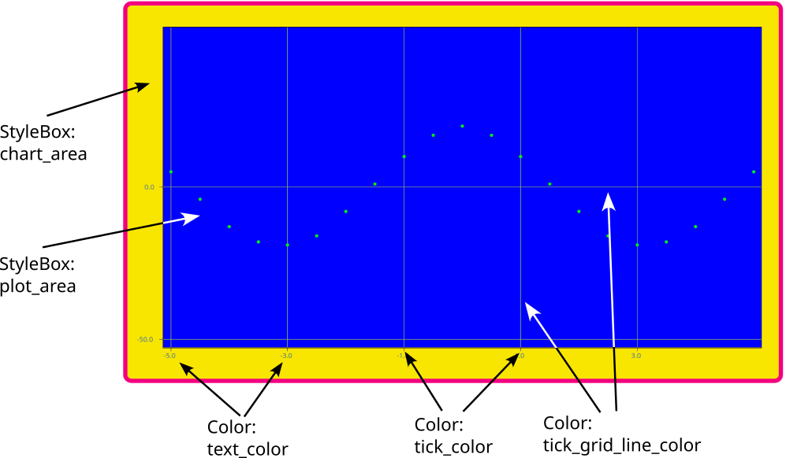

# Theming

Since version V28.08.25, themes are used to style easy charts.

> Deprecation note
>
> In previous versions, settings in `ChartPropeties` have been used. This is now deprecated and you should update to use themes instead!

If you want to learn by example, have a look at `addons/easy_charts/examples/theming/`. It contains a UI that allows to switch between different themes.

If you want to dive right into code, have a look at the `addons/easy_charts/control_charts/default_chart_theme.tres` resource. It contains the default configuration and shows which options are exposed.

## Create your own theme

To create your own theme, you can either

- create a copy of `addons/easy_charts/control_charts/default_chart_theme.tres` and assign it to your chart or any parent control node
- or you can copy its properties and assign it to one of your existing `Theme`s.

## Theme explained

The following image illustrates the theme items of the `Chart` control:

> Note on the plot_area StyleBox
>
> For the plot area, only the boder color and backgorund color properties of the stylebox work. In future, support for all stylebox options will be integrated.

## Changing themes at runtime

Due to backwards compatibility with previous versions of easy-charts, changing the theme at runtime is not fully supported. Right now, you have to destroy the chart and create a new instance. This is how the theming example works.
